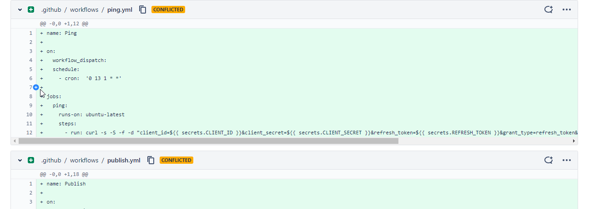

# bitbucket-conventional-comments

> [!WARNING]
> This extension is not actively maintained by the author and may not work properly on newer versions of Bitbucket. PRs are welcome.

Based on [this extension](https://gitlab.com/conventionalcomments/conventional-comments-button/-/tree/master) for Gitlab. Adapted to Bitbucket.

### What is this?

Quality of life Chrome extension for teams/people who use [conventional comments.](https://conventionalcomments.org) Adds buttons for automatically inserting conventional comment headers to your message.

The [original license](https://gitlab.com/conventionalcomments/conventional-comments-button/-/blob/master/LICENSE) is MIT.

### Installation

Available via the [Chrome Web Store.](https://chrome.google.com/webstore/detail/bitbucket-conventional-co/ahbhljoncimmieljhlkkeifohkigiefa)

#### From source

1. Clone this repository
2. Go to your chrome extensions (enter `chrome://extensions/` in the address bar)
3. Toggle Developer mode (on the right top corner)
4. Click "Load unpacked"
5. Select the repository folder
6. Reload bitbucket

### Settings

To configure settings, pin the extension to your taskbar by clicking the puzzle piece (extensions) at the top right of Chrome, followed by clicking the pin next to the extension. You may then enter the settings by pressing the extension icon in the taskbar (thicc black asterisk).
